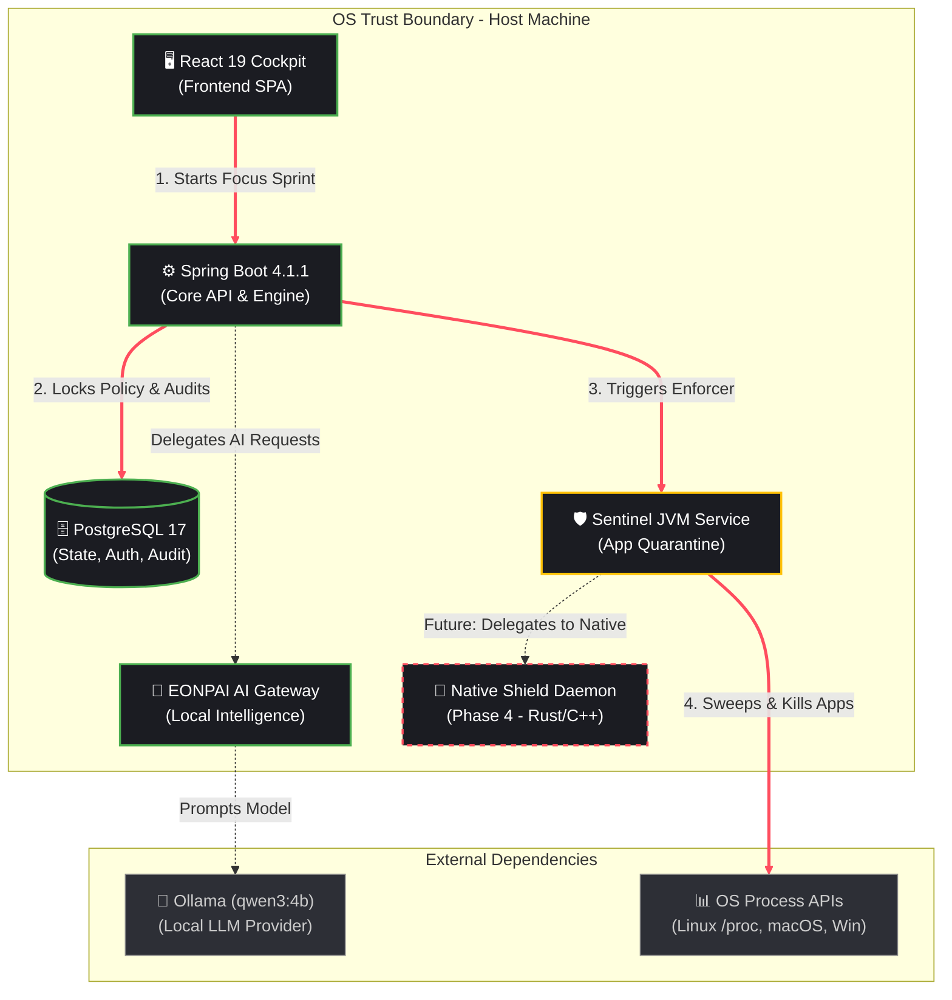

# SHINPO: Remaining Architecture & Implementation Hand-off

This document outlines the current state of the SHINPO project, clearly distinguishing what has been implemented from what remains to be built. It is designed to be easily read by another AI (like ChatGPT) to continue development or planning.

## 1. High-Level Runtime Architecture

Below is the runtime architecture focusing on the 8-12 core components, the primary execution path (Starting a Focus Sprint & Sentinel Enforcement), trust boundaries, and external dependencies.

### Component Details (Cards)

| Component | Status | Description |
|-----------|--------|-------------|
| **🖥️ React 19 Cockpit** | **DONE** | Dark luxury glassmorphism UI. Features Bento grid, Task Manager, Focus Timer, Sentinel rules, and EONPAI chat. |
| **⚙️ Spring Boot Backend** | **DONE** | Core orchestrator running Java 25. Handles JWT auth, REST APIs, JPA repositories, and session management. |
| **🗄️ PostgreSQL 17** | **DONE** | Source of truth. 14 Flyway migrations applied. Stores users, goals, missions, focus sessions, and Sentinel tamper events. |
| **🧠 EONPAI AI Gateway** | **DONE** | Contextual intelligence engine with strict read-only tools, deterministic fallbacks, and execution profile tracking. |
| **🦙 Ollama (qwen3:4b)** | **DONE** | External local LLM provider executing AI requests securely without cloud dependencies. |
| **🛡️ Sentinel JVM Service** | **PARTIAL** | Current implementation runs in the JVM, tracking processes via `ProcessHandle`, blocking blacklisted apps, and logging tampers. |
| **🦀 Native Shield Daemon** | **REMAINING** | Dedicated OS-level daemon (planned in Rust or C++) for secure, cross-platform process isolation and network blocking (WFP/macOS extensions). |
| **📊 OS Process APIs** | **EXTERNAL** | Host operating system hooks for detecting and terminating processes. |

---

## 2. What's Implemented (Completed Work)

The core foundation and intelligence layer are fully operational.

*   **Milestone 1 (Core Foundation):**
    *   Entity models, PostgreSQL database schema with Flyway.
    *   Stateless JWT authentication with refresh token rotation.
    *   Focus session engine (timer loops, active vs. paused states).
    *   2x2 Bento Cockpit React frontend with dark theme.
*   **Milestone 2 (EONPAI Intelligence):**
    *   Ollama integration with `qwen3:4b`.
    *   Tool registry and execution context (read-only safety bounds).
    *   Structured AI suggestions to database persistence bridge.
    *   Contextual Silence Engine (blocks AI planning theater during active sprints).
*   **Milestone 3 (Sentinel Process Hardening - Partial):**
    *   Linux process inspection and protected process whitelist.
    *   Distraction app quarantining and manual sweep triggers.
    *   *Phase 3.3 (Just Finished):* Task Manager permission boundary, administrative policy gate, and `SentinelTamperEvent` emergency overrides with BCrypt verification.

---

## 3. What's Left to Do (Remaining Work)

The following modules, integrations, and architectural shifts remain to be completed for the project to reach V1 production readiness.

### A. Architectural / System Level
*   **Phase 4: Native Shield & Host Process Decoupling (P0 Priority)**
    *   **The Problem:** Currently, the Spring Boot JVM process arbitrarily kills OS processes. This is fragile and will trip antivirus software on Windows/macOS.
    *   **The Solution:** Build `crates/shinpo-shield` (Rust), a dedicated background daemon to handle privileged OS containment, device admin (Android), or Network Extensions (macOS/iOS).
    *   **Task:** Restrict JVM `/api/device/processes/{pid}/terminate` and establish a secure IPC/gRPC pairing protocol between the Java backend and the Rust shield.
*   **Phase 4.2 & 4.3:**
    *   Windows Filtering Platform (WFP) / macOS Endpoint Security layer integration.
    *   Local-first offline telemetry synchronization.
*   **Containerization & Packaging:**
    *   Multi-stage Dockerfiles for Spring Boot (Alpine/Distroless) and React (Nginx).
    *   `docker-compose.yaml` full orchestration with health checks.

### B. Frontend / UI Features
*   **Goals & Missions Full CRUD UI:** Beyond the basic dashboard, a dedicated view to manage long-term goals and their dependency chains.
*   **Schedule Builder:** A calendar drag-and-drop interface for mapping missions to daily time blocks.
*   **Advanced Analytics:** Deeper views into mission velocity, estimation bias (using the backend data we collect), and goal progress charts.
*   **Journal / Debrief Module:** A dedicated UI to review past session debriefs and cognitive recovery paths.
*   **Settings Page:** Comprehensive configuration for themes, notification preferences, and AI behavior.

### C. Backend & AI Integrations
*   **AI.8 — Recovery Intelligence:** Classify session interruptions (Plan vs. Execution failure) and suggest recovery paths.
*   **AI.9 — Command Center Summarization:** Multi-dimensional state summaries generated by EONPAI.
*   **AI.10 — Safe Device & Policy Intelligence:** AI explainability for distraction blocks.
*   **Gamification & Rewards Engine:** XP, streaks, and progression models driven by intrinsic motivation (requires behavioral science validation).
*   **Adaptive Time Estimation (ML):** Transition from simple moving averages to Bayesian updating for predicting task duration bias.
*   **Security Hardening:** AI endpoint rate-limiting and DPDP Act compliance (data retention/deletion policies).

---

**Next Action for Handoff:**
Provide this document to ChatGPT. Instruct it to begin **Phase 4.1 (Native Rust Shield Daemon Integration)** or to build out the **Goals & Missions CRUD UI** depending on whether you want to tackle systems architecture or frontend product features next.
