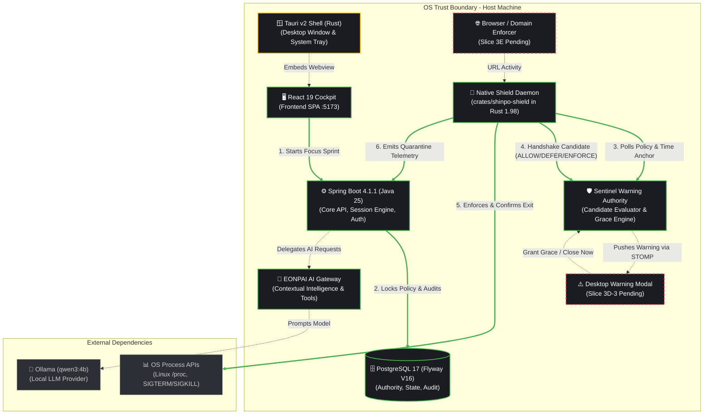

# SHINPO: Architecture & Engineering Handoff Document

> **CURRENT STATUS**: Post-Slice 3D-2B (`76e0a9f`)  
> **Backend Suite**: 185/185 tests passing  
> **Rust Shield Suite**: 33/33 tests passing  
> **Purpose**: Serves as the complete architectural memory and execution plan for humans and AI agents.

---

## 1. High-Level Runtime Architecture

### Component Status Matrix

| Component | Status | Location | Description |
|-----------|--------|----------|-------------|
| **🖥️ React 19 Cockpit** | **DONE** | `frontend/` | Dark luxury glassmorphism UI with Bento grid, session timers, task manager, and EONPAI chat. |
| **⚙️ Spring Boot Backend** | **DONE** | `backend/` | Java 25, Spring Boot 4.1.1. JWT auth, refresh token rotation, focus sessions, and Flyway V16. |
| **🗄️ PostgreSQL 17** | **DONE** | Docker / Compose | Single source of truth. 16 migrations applied. Zero orphaned warning or grace records. |
| **🛡️ Sentinel Warning Authority** | **DONE** | `backend/.../SentinelWarningService.java` | 60s warning deadlines, 1–20m server grace calculations, candidate evaluation, and audit tagging. |
| **🦀 Native Shield Daemon** | **DONE** | `crates/shinpo-shield/` | Native Rust 1.98 daemon. Process scanner, platform interceptor, server time anchor, offline spooler. |
| **🧠 EONPAI AI Gateway** | **DONE** | `backend/.../ai/` | Safe read-only AI tools, contextual silence during active sprints, and Ollama `qwen3:4b` bridge. |
| **🪟 Tauri v2 Shell** | **PARTIAL** | `frontend/src-tauri/` | Desktop packaging scaffolding and embedded webview host. |
| **⚠️ Desktop Warning Modal** | **REMAINING (Slice 3D-3)** | Frontend/Tauri | Visual 60s countdown overlay and grace selector triggered via WebSocket. |
| **🌐 Browser Domain Enforcer** | **REMAINING (Slice 3E)** | Extension / Native | Domain/URL-level tab containment for web-based distractions. |

---

## 2. What Is Fully Implemented & Verified

### Milestone 1 & 2: Core Foundation & AI Layer
- Complete entity model (`Goal`, `Mission`, `FocusSession`, `User`, `RefreshToken`).
- JWT authentication filter with single-use refresh token rotation.
- Contextual silence engine: AI suppresses chatter and avoids task generation during active sprints.
- Ollama local inference integration with deterministic fallbacks.

### Milestone 3: Sentinel Process Hardening (Slices 3A through 3D-2B Complete)
- **Slice 3A (`feat: add fail-closed sentinel daemon sync`)**:
  - `GET /api/sentinel/daemon-sync` exposes active focus session status, blocked patterns, allowed patterns, and protected system whitelist.
  - Fail-closed contract: absent active session disables destructive action.
- **Slice 3B (`feat: add process termination verification`)**:
  - Rust Shield `verify_target_exit`: checks process exit via repeated 50ms checks.
  - PID reuse protection: verifies process name matches target before confirming exit.
  - `OfflineSpooler`: disk-backed event buffer for offline resilience.
- **Slice 3C (`feat: add contextual focus session enforcement`)**:
  - `FocusSessionEnforcementException` allows temporary, session-scoped process overrides without modifying global user policy.
  - Spotify and VLC removed from hardcoded distraction lists (music policy).
- **Slice 3D-1 (`feat: add sentinel warning and grace authority`)**:
  - Database entities and Flyway V16 migration for `SentinelEnforcementWarning` and `SentinelGraceWindow`.
  - Server-calculated 60s decision deadlines and 1–20 min grace limits.
- **Slice 3D-2A (`feat: implement workstation warning and grace sync`)**:
  - Synchronous candidate evaluation endpoint (`POST /api/sentinel/warnings/evaluate-candidate`).
  - Workstation Shield candidate handshake: first detection issues warning and defers; only `ENFORCE_TERMINATE` triggers termination.
- **Slice 3D-2B (`feat: complete warning and grace enforcement lifecycle`)**:
  - Parent warning state auto-expires when associated grace window expires.
  - Grace window transitions to `CONSUMED` exclusively upon verified quarantine enforcement.
  - Grace requests on expired/overdue focus sessions are rejected with HTTP 409 Conflict.
  - Quarantine records retain audit tags: `[WARNING_EXPIRED]` and `[GRACE_EXPIRED]`.

---

## 3. What Needs to Be Hardened (Production Hardening)

1. **Windows SmartScreen & Defender Heuristics**:
   - `TerminateProcess` calls in `shinpo-shield.exe` will trigger Windows Defender without code signing.
   - **Action**: Obtain EV Certificate, set up GitHub Actions code-signing pipeline, and test execution under Windows Defender real-time protection.
2. **Wayland Display Server Limitations**:
   - On Linux Wayland (GNOME / KDE), processes cannot inspect window titles of other applications via X11 calls.
   - **Action**: Rely on `/proc` process table scanning or implement desktop portal APIs for foreground window detection.
3. **macOS App Sandbox Entitlements**:
   - Non-root processes cannot send `SIGKILL` to processes owned by different user sessions or sandboxed apps.
   - **Action**: Distribute the native shield as a signed, notarized non-sandboxed helper daemon.
4. **Tauri IPC Bridge Security**:
   - Secure the interface between the React webview and Tauri native backend to prevent unauthorized command execution.
5. **Database Connection Pool Resilience**:
   - High-frequency batch spool flushes from offline daemons should use JDBC batching to avoid pool exhaustion.

---

## 4. What's Left to Do (Remaining Implementation Roadmap)

### Immediate Next Step: Slice 3D-3 (Desktop Warning UI & Realtime STOMP Push)
1. **STOMP Broadcast**: Configure Spring Boot `WebSocketEventService` to broadcast warnings to `/topic/users/{id}/sentinel/warnings`.
2. **React/Tauri Warning Overlay**:
   - Dedicated borderless, always-on-top modal.
   - 60-second circular countdown timer.
   - Grace selector (1 to 20 minutes, bounded by remaining session time).
   - "Grant Grace" and "Close App" action buttons.

### Slice 3E: Browser Activity & URL Filtering
1. Lightweight browser extension or local DNS loopback filtering to intercept distraction URLs (YouTube, Twitter, Reddit) while preserving productive browser use.
2. Link URL policies to the active `FocusSession`.

### Slice 4: Desktop Shell Integration (System Tray & Autostart)
1. Tauri system tray with active session status and quick controls.
2. Cross-platform autostart service for `shinpo-shield`.

### Slice 5: AI Post-Sprint Debrief
1. Post-session reflection dialog.
2. EONPAI Sprint Fidelity calculation based on quarantine metrics.

---

## 5. Invariant Rules for Future AI Agents
1. **Never kill without server authorization**: The Shield must only terminate when the backend returns `ENFORCE_TERMINATE`.
2. **Never trust client clocks**: All deadlines and expirations must be calculated server-side.
3. **Preserve existing tests**: Always ensure `./mvnw test` (185 tests) and `cargo test` (33 tests) pass without regression.
4. **Fail-closed**: Any unexpected error or missing session state must result in safe deferral rather than process termination.
