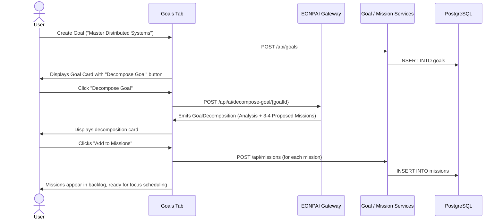

# SHINPO — Application Flow & User Journeys (APP_FLOW.md)

**Document Version:** 1.0.0-PROD  
**Status:** Approved & Living Document  
**Scope:** Complete frontend user experience, state transitions, navigation routes, edge cases, and EONPAI conversational interactions.

---

## 1. System Navigation & Application Shell

SHINPO uses a single-page reactive application shell driven by URL search parameters and local state (`activeTab`):

```
┌────────────────────────────────────────────────────────────────────────────────────────┐
│ TOP BAR: SHINPO Brand Logo | Focus Status Badge | Theme Toggle (Light/Dark) | User Me  │
├──────────────┬─────────────────────────────────────────────────────────────────────────┤
│ SIDEBAR      │ MAIN VIEWPORT (Renders activeTab component)                              │
│ • Dashboard  │                                                                         │
│ • Goals      │                                                                         │
│ • Focus      │                                                                         │
│ • Calendar   │                                                                         │
│ • Analytics  │                                                                         │
│ • Tasks      │                                                                         │
│ • EONPAI     │                                                                         │
│ ──────────── │                                                                         │
│ EONPAI Card  │                                                                         │
│ Sentinel Dot │                                                                         │
└──────────────┴─────────────────────────────────────────────────────────────────────────┘
```

### URL Parameter Contracts:
- `?tab=Dashboard` $\rightarrow$ Command Center Dashboard
- `?tab=Goals & Missions` $\rightarrow$ Goal & Mission Backlog
- `?tab=Focus Engine` $\rightarrow$ Live Focus Session Cockpit
- `?tab=Schedule` $\rightarrow$ Calendar & Session Agendas
- `?tab=Analytics` $\rightarrow$ Historical Execution Analytics
- `?tab=Task Manager` $\rightarrow$ Host System & Process Management
- `?tab=AI Assistant` $\rightarrow$ EONPAI Conversational Intelligence
- `?theme=light` / `?theme=dark` $\rightarrow$ Theme mode toggle

---

## 2. Core User Journeys

### Journey 1: Authentication & Session Gate
1. **Unauthenticated Entry**:
   - User visits `http://localhost:5173/`.
   - If no valid `shinpo_auth_token` exists in `localStorage`, the **Auth Cockpit Gate** renders.
   - User can toggle between **Login** and **Register**.
2. **Registration / Login**:
   - Submits credentials (`username`, `email`, `password`) to `/api/auth/register` or `/api/auth/login`.
   - On HTTP 200, JWT token and user profile are saved to `localStorage` (`shinpo_auth_token`, `shinpo_auth_user`).
   - The shell immediately initializes and displays the `Dashboard` tab.
3. **Session Restoration & Expiration**:
   - On page load, `fetchCurrentUser()` verifies token validity against `/api/auth/me`.
   - If token is expired, `refreshToken()` attempts automatic rotation against `/api/auth/refresh`.
   - If refresh fails, `clearAuthSession()` purges storage and returns the user to the login gate.

---

### Journey 2: Strategic Goal Decomposition & Mission Planning


---

### Journey 3: The Deep Work Focus Cycle
```
[Select / Arm Mission]
        │
        ▼
[Configure Focus Sprint] ── (Duration: 15 / 25 / 45 / 60 min, Intention)
        │
        ▼
[Start Focus Session] ──── (POST /api/focus-sessions/{id}/start)
        │                  (Sentinel Engaged: Distraction Apps Quarantined)
        ▼
[Active Countdown Timer]
        ├── Pause / Resume ── (POST /api/focus-sessions/{id}/pause / resume)
        ├── Emergency Escape ── (Modal: Require reason; POST /api/focus-sessions/{id}/cancel)
        └── Timer Reaches Zero
                 │
                 ▼
[Session Debrief Modal] ── (Rate quality 1-5, Outcome: Success/Partial/Failed, Notes)
                 │
                 ▼
[Complete Focus Session] ── (POST /api/focus-sessions/{id}/complete)
                 │          (Sentinel Disengaged; Distraction Apps Restored)
                 ▼
[Analytics & History Updated]
```

---

### Journey 4: EONPAI Conversational Intelligence & Quick Actions
1. **Entry**:
   - User clicks `EONPAI` in sidebar, or clicks the action button on the sidebar companion card.
2. **Left Panel: Preset Quick Actions**:
   - `Plan My Execution Day`: Generates a structured 3-block daily itinerary.
   - `Start Guided Walkthrough`: Triggers interactive DOM tutorial overlay.
   - `Check Sentinel Status`: Inspects active focus blocks and explains quarantined processes.
   - `Report an Issue / Bug`: Sanitizes browser diagnostics and files an issue tracking ID.
   - `What is My Next Action?`: Computes highest-leverage pending mission.
   - `Deconstruct Top Goal`: Partitions active goal into actionable sprints.
3. **Right Panel: Conversational Feed**:
   - Free-form natural language chat with message streaming and auto-follow scrolling.
   - Assistant responses render rich structured cards:
     - **Next Action Card**: Displays mission title, estimated minutes, and a "Start Focus" button.
     - **Daily Plan Card**: Interactive list of scheduled execution blocks.
     - **Recovery Card**: 3 restorative options (Micro-Sprint, Recess, Split Mission).
     - **Bug Report Card**: Displays sanitized tracking ID and confirmation.
4. **Conversation Management**:
   - "New Chat" archives current conversation in database and starts a fresh thread.

---

### Journey 5: Sentinel & Task Manager Inspection
1. **Entry**:
   - User selects `Task Manager` tab.
2. **System Telemetry Bar**:
   - Displays Workstation Hostname, OS Kernel version, Architecture, CPU Load %, and RAM (Used / Total).
3. **Process Grid & Filtering**:
   - Process list updates with real OS processes.
   - Filter chips: `ALL`, `ALLOWED` (green), `BLOCKED` (red), `PROTECTED` (purple).
   - Search bar filters processes dynamically by PID or executable name.
4. **Process Termination**:
   - Clicking `Terminate` opens a confirmation modal displaying the target PID and executable path.
   - Confirmed action sends `POST /api/device/processes/{pid}/terminate?force=true`.
   - System updates list and notifies user of result.

---

### Journey 6: Execution Analytics & Retrospective
1. **Entry**:
   - User selects `Analytics` tab.
2. **Metrics Rendered**:
   - Total Focus Minutes completed.
   - Weekly Completion Velocity (bar graph of daily focus minutes).
   - Session Success vs Failure distribution.
   - Recent Session Debriefs table (showing intention, actual time, quality rating, and notes).

---

### Journey 7: Guided Interactive Tutorial Overlay
1. **Trigger**:
   - Triggered either by clicking "Start Guided Walkthrough" in EONPAI, or clicking the Tutorial launcher.
2. **Mechanics**:
   - `TutorialOverlay.tsx` computes bounding box coordinates of the target DOM element (e.g. `[data-tour="nav-focus"]`).
   - Dimmed backdrop illuminates the target element with a floating tooltip.
   - User interacts with the highlighted element to satisfy the `completionCondition`, advancing to the next step.

---

## 3. Edge Cases, Empty States & Failure Handling

| State / Condition | System Behavior & User Recovery |
| :--- | :--- |
| **Empty Goals List** | Goals tab renders empty state card: "No active goals found. Set your north star objective." with a primary CTA button "Create First Goal". |
| **Empty Missions List** | Missions panel renders: "No pending missions. Break down an active goal or add a quick mission." |
| **AI Provider Offline** | If Ollama is unreachable, `AiGateway` activates the deterministic fallback engine. A toast notification or card indicates: "Running in Offline Deterministic Mode". Core planning and next-action calculations continue working. |
| **Focus Session Interruption** | If a session is cancelled or aborted, the system transitions to the **Recovery Flow**, offering options to take a 10-minute break, start a micro-sprint, or split the mission. |
| **Token Expiry Mid-Session** | If JWT access token expires during a focus session, the client issues a silent refresh request to `/api/auth/refresh`. Timer execution is never blocked or reset. |
| **Direct URL Invalid Tab** | If a user opens `?tab=InvalidTab`, the system falls back to the `Dashboard` tab and updates the URL cleanly. |
| **Responsive Mobile Layout** | On mobile screens ($<768\text{px}$), the sidebar collapses into a floating bottom bar or slide-out drawer, preserving full timer and chat usability. |
