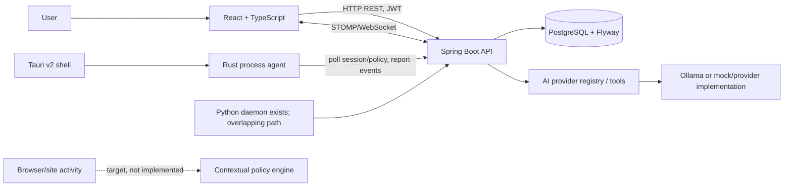

# SHINPO Architecture

This document separates architecture evidenced in the repository from target architecture. Source and tests outrank generated diagrams and audit snapshots. Baseline inspected 2026-10-02.

## System Context

## Current Implementation

### React client

`frontend/` contains a React/TypeScript/Vite SPA with a central `App.tsx`, API modules, theme styles, tutorial overlay, scheduling/session controls, assistant, analytics, process management, and WebSocket event handling. Functional source does not establish product completion: the UI still has terminology/information-hierarchy issues, native date controls, fabricated analytics defaults, and no live Overview wall clock.

### Spring Boot service boundary

`backend/` contains HTTP controllers, service-layer logic, JPA repositories/entities, Spring Security/JWT, Flyway schema, AI orchestration, scheduled Sentinel/session jobs, and a STOMP broker. Controllers commonly obtain user identity from `UserPrincipal`, and services perform ownership checks. This is not a security certification: all routes, tools, and process-control entry points need systematic authorization review.

### Persistence

PostgreSQL is the durable store; inspected tests reported schema version 14 and 14 Flyway migrations. Models cover users, goals, missions, mission completions/progress, focus sessions, session plans/intervals, refresh tokens, AI suggestions, conversations/messages, bug reports, policy rules, quarantine records, and tamper events. No dedicated paired-device registry or browser-activity model was identified. Scheduling centers on session instants and mission dates rather than a general calendar-entry collection.

### AI boundary

The Java AI package contains provider abstraction/registry, Ollama and mock providers, context assembly, tool registry, suggestions, planning, briefing, recovery/debrief, execution-profile flows, and conversation persistence. `AiController` binds chat to the authenticated principal. The tool registry contains information retrieval as well as state-changing/operational tools; “all tools are read-only” is false. Consequential operations need explicit approval policy and must pass normal service authorization. A deterministic/provider fallback exists, but app-wide resilience, data retention, rate limiting, and prompt-injection guarantees are not release-certified.

### Process enforcement and desktop

Three overlapping process-control paths exist:

1. Java `SentinelEnforcementService` scans processes on the backend host with `ProcessHandle`, default distraction patterns, user rules, and mode-dependent stop/force-stop behavior.
2. `crates/shinpo-shield` uses `sysinfo`, polls the Sentinel sync API, applies blocked/allowed/protected name patterns, calls OS process termination, and stores failed-to-upload telemetry in a local JSONL spool.
3. `daemon/shinpo_shield.py` plus config/systemd files preserve a Python process-monitoring path. Its deployment/retirement relation to Rust/Tauri is not established; simultaneous agents could duplicate enforcement.

`frontend/src-tauri` contains Tauri v2 command wiring that starts a Rust shield thread polling a local-default API URL. This does not prove full desktop packaging, device pairing, a native warning overlay, or platform release readiness.

Rust uses a fixed protected-name set and accepts more protected names from sync. Its fallback patterns include Discord, Steam, Spotify, VLC, OBS, and other apps. Strict mode can force-terminate by PID; immediate process start-time/executable/device revalidation is not evident. The user describes a video showing OBS terminated during SHINPO recording; source independently confirms a credible unsafe path. `TaskManagerService` separately exposes backend-host processes and synthetic per-process CPU/memory estimates.

### Realtime and offline telemetry

Backend STOMP/WebSocket configuration and event service distribute focus-session and Sentinel status/quarantine events to user topics. The frontend subscribes and updates UI. Rust polling retries and a JSONL spool supports later batch sync. This is bounded event telemetry, not a complete offline-first app or verified exactly-once protocol. Cross-tab timer authority and cross-device conflict resolution remain open.

## Trust Boundaries

1. **Client/UI:** browser values and authored content are untrusted; client state is never authorization.
2. **Identity/API:** JWT principal supplies user identity. Nested resource ownership and body/query IDs must be independently checked.
3. **Domain/database:** services own state changes and dependency ordering. Bulk delete exists only for goals and missions.
4. **AI/provider/tools:** model output and tool arguments are untrusted proposals. Every mutating tool reauthorizes and follows the approval contract.
5. **Local agent/OS:** backend policy is not a safety proof. Validate paired device, process identity, protected categories, policy freshness, and result immediately before action.
6. **Realtime/offline store:** events may be delayed, duplicated, stale, or replayed. Define IDs, idempotency, expiry, retention, and privacy before claiming strong audit semantics.
7. **External provider/deployment:** provider routing and configuration are separate trust zones; data routing and retention need explicit rules.

## Target Focus Protection Architecture

Target decision pipeline:

`ACTIVITY IDENTITY -> ACTIVE SESSION -> OBJECTIVE -> TASK -> USER POLICY -> EXCEPTIONS -> BREAK/RECOVERY -> SAFETY EXCLUSIONS -> DECISION + EXPLANATION`

The same app/site may be useful or distracting depending on task context. Browser signals must be first-class but privacy-bounded. No automatic termination may be based solely on a process name.

Target intervention sequence:

`DETECT -> IDENTIFY -> EVALUATE CONTEXT -> APPLY POLICY/EXCEPTIONS -> WARN -> OPTIONAL GRACE (<= 20 MIN) -> ACT -> VERIFY OUTCOME -> AUDIT`

A future Tauri/native warning window owns explanation, countdown, current session/task, user actions, keyboard/focus management, reduced motion, and safe fallback. Browser integration, grace UX, and action verification are migration requirements.

## Session and Time Architecture

Current focus enum: `SCHEDULED`, `ACTIVE`, `PAUSED`, `COMPLETED`, `CANCELLED`, `EXPIRED`, `FAILED`. The entity stores instants and pause accumulators; services enforce transitions and expiry. Session plans may contain FOCUS, SHORT_BREAK, LONG_BREAK intervals, but no persisted BREAK state appears in the focus enum and the frontend timer does not execute a verified interval state machine.

Target time contract:

- Persist timestamps as UTC instants.
- Preserve date-only selections as local calendar dates, not values round-tripped through UTC midnight.
- Define user/device timezone consistently for schedules, “today”, analytics windows, and display.
- Derive timer state from authoritative timestamps and accounted pauses; recompute after tab suspension/reconnect.
- Keep live local wall clock separate from session time.

Current frontend code uses `toISOString().split('T')[0]` for date inputs and builds scheduled timestamps with a `Z` suffix. Analytics combines server `LocalDate.now()` with UTC session-day extraction. This is not a coherent user-local contract.

## Destructive Operations

Current bulk routes are `DELETE /api/goals/all` and `DELETE /api/missions/all`; controllers derive owner from principal. Goal deletion removes that user's linked missions; mission clearing preserves goals. UI confirms counts/scope and handles errors. Focus sessions have single-record deletion only. Assistant “clear active conversation” archives the active conversation and creates a fresh one; it does not mean deleting all conversation history. No general notification/activity-history bulk route was identified. Never provide a generic cross-collection delete action.

## Cross-Device Target

Tier 1 target: Linux, Windows, Android. Later target: macOS, iOS. Device pairing, scoped authentication/revocation, policy version/lease, capabilities, offline expiry, telemetry source identity, conflict resolution, and authoritative state sync are not established by current schema. OS adapter code is not platform certification. Android/iOS support is not implemented evidence.

## Security, Privacy, and Failure Modes

Retain JWT authentication, principal-derived ownership, service authorization, schema migrations, and audit records, but do not describe these as complete hardening. Review production secrets, CORS, actuator exposure, rate limiting, AI tool permissions, host-vs-device process scope, target identity, agent revocation, telemetry retention, and data deletion. Process-control failure, provider/backend outage, stale policy, timer/client divergence, duplicate events, and OS permission errors need visible recoverable behavior.

Collect only data required for an execution/protection feature. Document purpose, source, storage, access, retention, deletion, and transfers. Prohibit screenshots, keystrokes, document contents, passwords, and covert monitoring.

## Migration Boundaries

1. **P0 safety:** disable/contain unsafe automatic termination; separate activity identity from policy; validate target identity; define protected decisions and verified outcomes.
2. **P1 correctness:** align analytics metrics; fix pause-aware timer and local scheduling; add live clock/date policy; verify persistence/reload.
3. **P1 UX:** professional terminology, scheduling form, daily quote lifecycle, contextual protection explanation, reusable date picker.
4. **P2 platform:** define paired-device/browser-agent contracts, policy synchronization, offline lease/conflict handling, and OS verification before claiming cross-device support.

This audit makes no source-code changes. The recommended first engineering slice is in [SHINPO_IMPLEMENTATION_STATUS.md](SHINPO_IMPLEMENTATION_STATUS.md).
