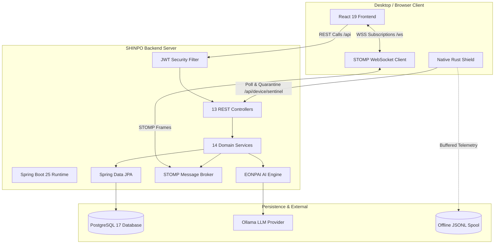

# 15 — Actual Dependency Graph

```mermaid
flowchart TD
    subgraph Client [Desktop / Browser Client]
        React[React 19 Frontend]
        WSClient[STOMP WebSocket Client]
        Shield[Native Rust Shield]
    end

    subgraph Server [SHINPO Backend Server]
        Spring[Spring Boot 25 Runtime]
        Security[JWT Security Filter]
        Controllers[13 REST Controllers]
        Services[14 Domain Services]
        EONPAI[EONPAI AI Engine]
        WSBroker[STOMP Message Broker]
        JPA[Spring Data JPA]
    end

    subgraph Storage [Persistence & External]
        PG[(PostgreSQL 17 Database)]
        Ollama[Ollama LLM Provider]
        Spool[(Offline JSONL Spool)]
    end

    React -->|REST Calls /api| Security
    React <-->|WSS Subscriptions /ws| WSClient
    WSClient <-->|STOMP Frames| WSBroker
    Security --> Controllers
    Controllers --> Services
    Services --> JPA
    Services --> WSBroker
    Services --> EONPAI
    EONPAI --> Ollama
    JPA --> PG
    Shield -->|Poll & Quarantine /api/device/sentinel| Controllers
    Shield -.->|Buffered Telemetry| Spool
```
